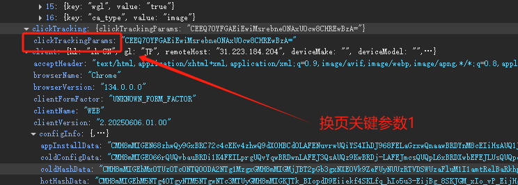
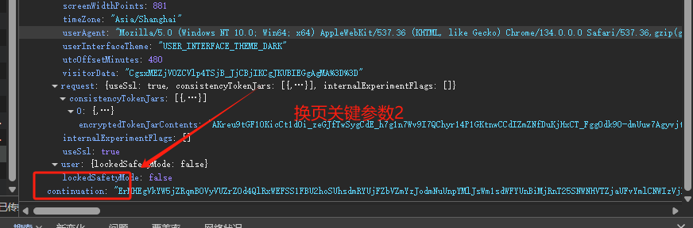
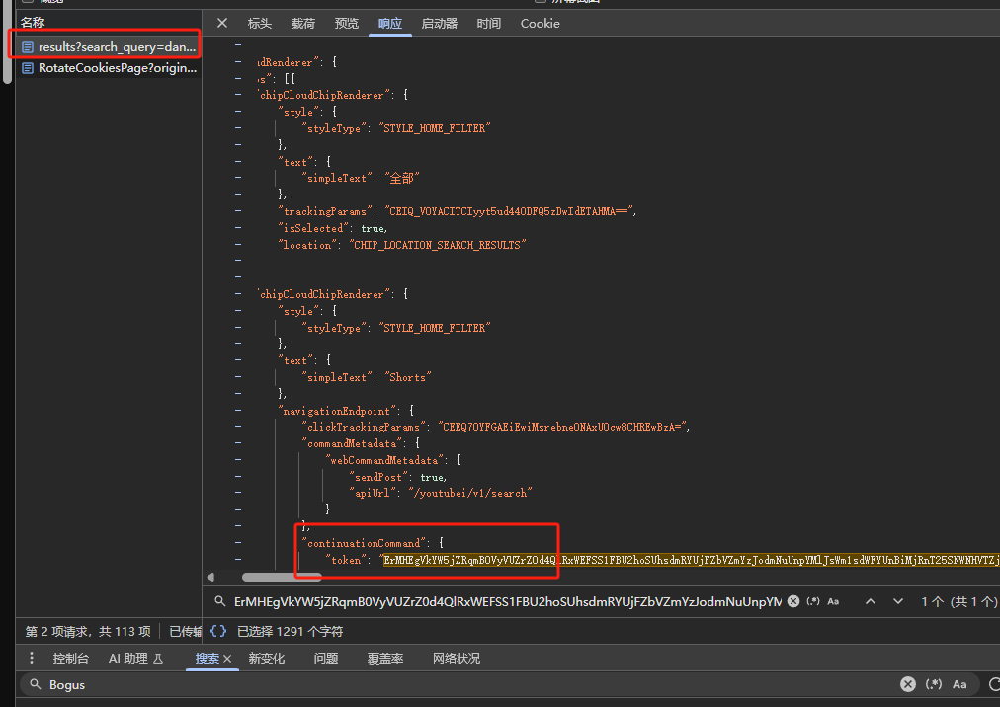

# YouTubeSpider
### 这个项目是油管的一个采集程序
## 主要功能：
1. 获取视频的播放地址
    具体思路如下：
        `目标接口：https://www.youtube.com/youtubei/v1/search?prettyPrint=false`
         参数详情：
                
               
         如以上两个关键换页参数，以下为这俩换页参数的位置
        
        其实就在这里,就在可以直接get的url：https://www.youtube.com/results?search_query=dance
        然后就是下一页，这个比较坑，下一页的请求参数的值的位置其实也就在当前请求的返回值里面，但是一定要注意不要搞错了，YouTube_Serch里有专门的函数去获取这些参数。
        很简单吧
2. 下载视频
    下载视频环节用到的就是yt_dlp,过滤掉不满足要求的视频。
3. 还需要对视频进行分析，这个比较蛋疼
    这个正在研究AI接口来分析视频，本地训练一个模型是不可靠的。
